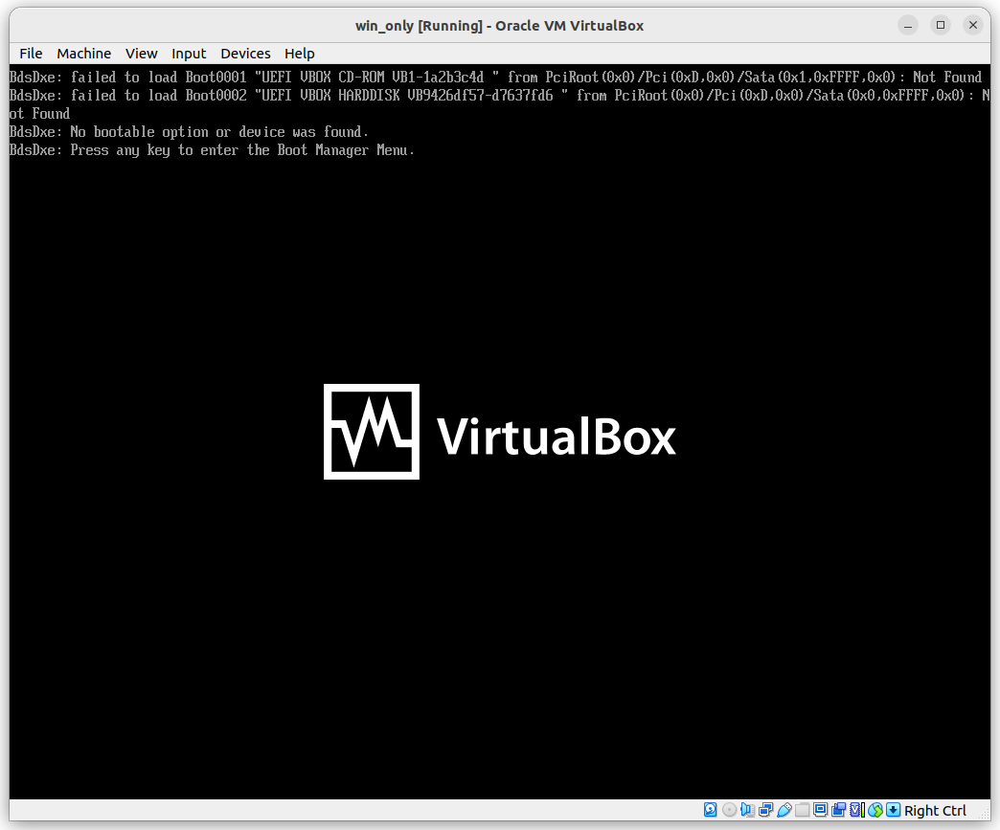
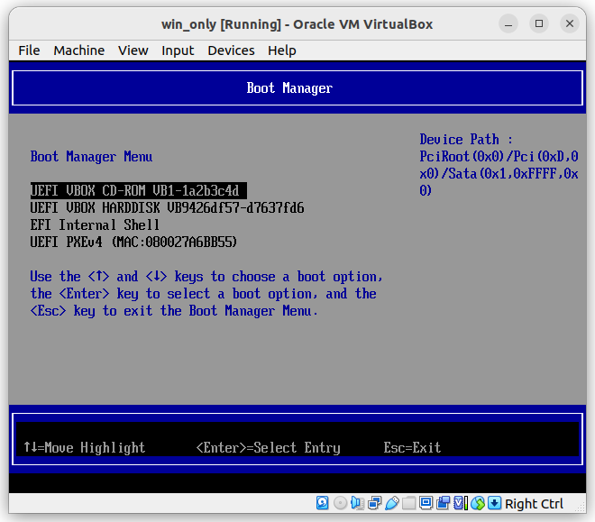
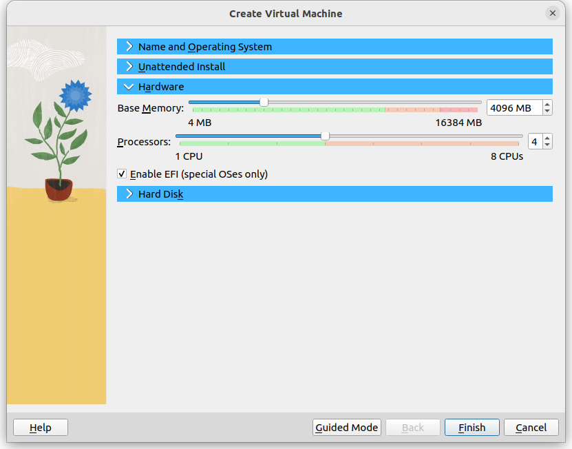
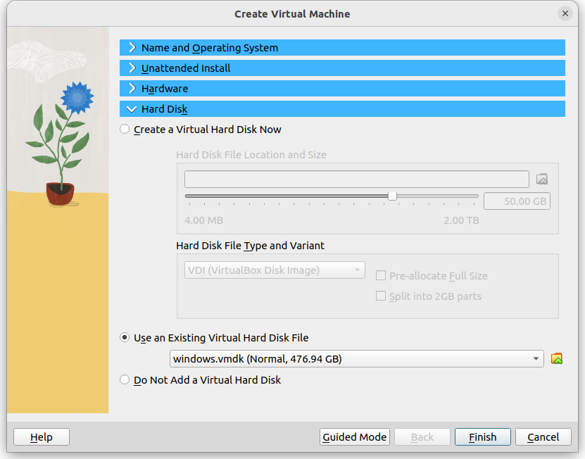
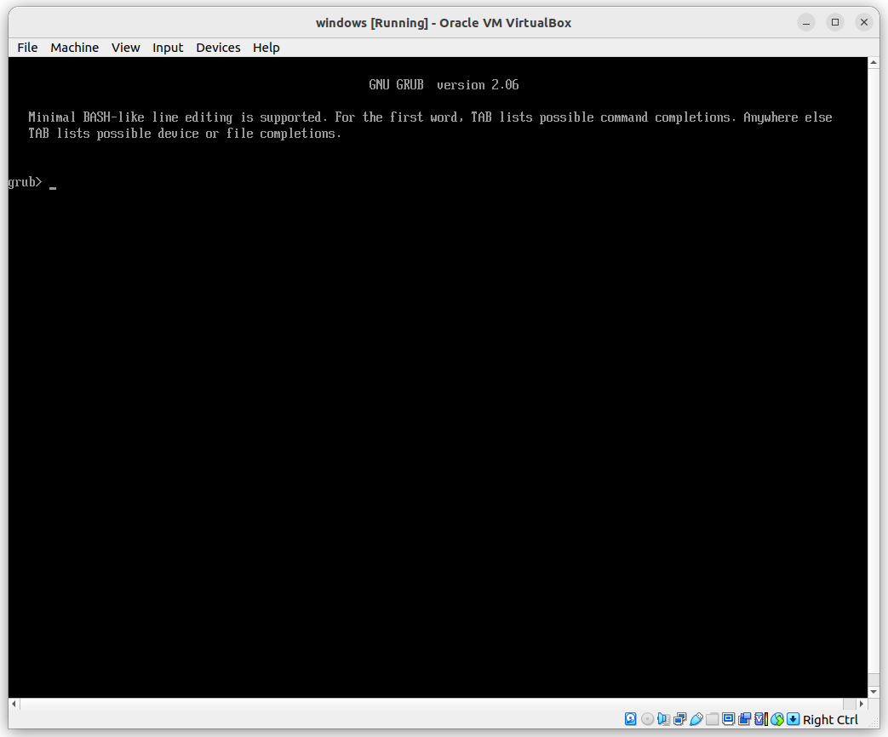
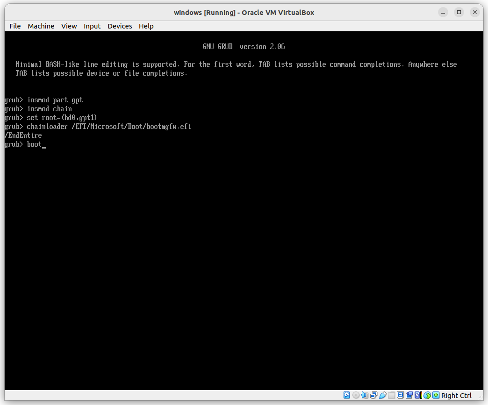
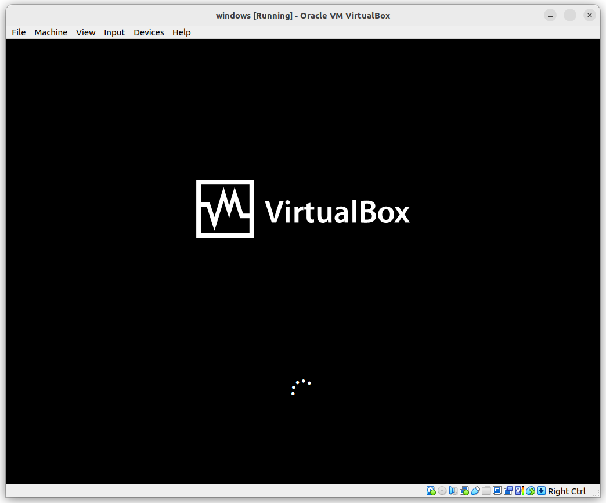
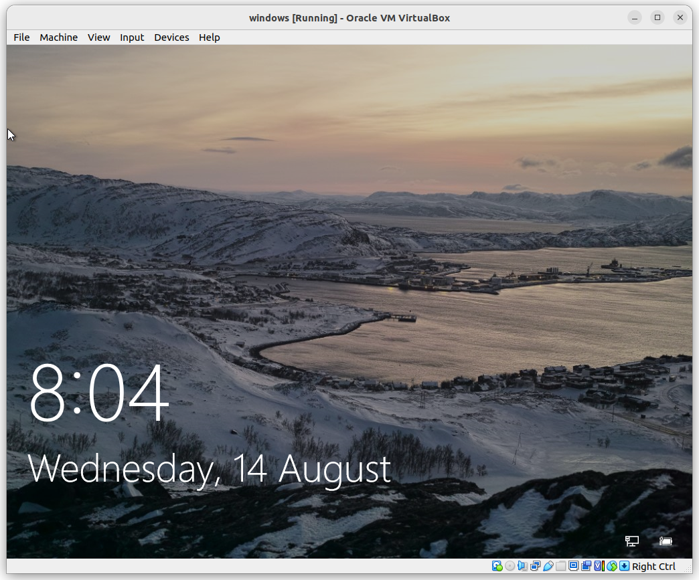

# Ubuntu host boot physical Windows 10 using Virtualbox

I mostly use Ubuntu for development, but sometimes, some software is Windows 10 only, and it cannot run by Wine. So, I need help with physical Windows 10. Previously, booting Windows 10 by Virtualbox was working perfectly by following Jamieweb. Somehow, recently, it has stopped working, and the Virtualbox forum reported a similar situation.

### Issue:
Virtualbox cannot find the boot option even if it enabled the EFI.




Here is the configuration that works for Windows 10. 


### Identifying the Disk and setting up the virtual Disk
   
My old Dell XPS 15 9560 laptop has a single 512GB disk. Both Windows 10 and Ubuntu are installed in it. 
```
$ lsblk
NAME        MAJ:MIN RM   SIZE    RO TYPE MOUNTPOINTS
nvme0n1     259:0   0    476.9G  0  disk 
├─nvme0n1p1 259:1   0    100M    0  part /boot/efi
├─nvme0n1p2 259:2   0    16M     0  part 
├─nvme0n1p3 259:3   0    375.1G  0  part /mnt/windows
├─nvme0n1p4 259:4   0    1.8G    0  part 
├─nvme0n1p5 259:5   0    84.1G   0  part /var/snap/firefox/common/host-hunspell
│                                     /
└─nvme0n1p6 259:6   0    15.9G   0  part [SWAP]
```

We need the /boot/efi and /mnt/windows partitions which is 1, 3
For example, I input the following command for my system
```
sudo VBoxManage internalcommands createrawvmdk -filename windows.vmdk -rawdisk /dev/nvme0n1 -partitions 1,3
```

### File System Permissions
sudo usermod -a -G disk youruser

### Creating and Configuring the Virtual Machine
The Virtualbox version is 7.0
Increase the base memory to 4096MB, 4CPUs and enable EFI


Select the hard disk file created by `VBoxManage` command.



### Grub Command
Then power on the virtual machine and it will boot into Grub

Input the following Grub command
```
insmod part_gpt
insmod chain
set root=(hd0,gpt1)
chainloader /EFI/Microsoft/Boot/bootmgfw.efi
boot
```


The system will boot into physical Windows



Cheers!


### Reference
[1] "Booting a Physical Windows 10 Disk Using VirtualBox on Linux" virtualbox Forum. http://chriscurrin.com/2021/virtualbox-raw-disk-with-ubuntu-host-and-windows-guest-on-the-same-drive/
[2] "Booting a Physical Windows 10 Disk Using VirtualBox on Linux" jamieweb. https://www.jamieweb.net/blog/booting-a-physical-windows-10-disk-using-virtualbox-on-linux/
[3] "How to start a windows partition from the Grub command line" stackExchange. https://unix.stackexchange.com/questions/259069/how-to-start-a-windows-partition-from-the-grub-command-line
